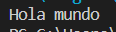
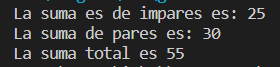
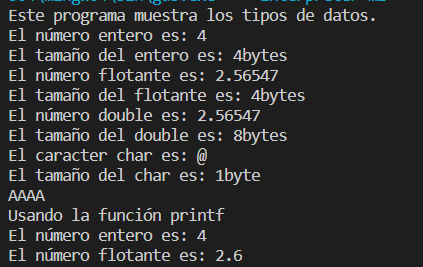
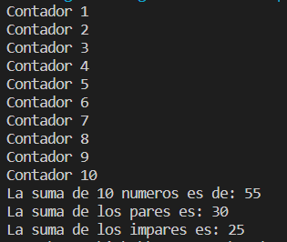
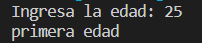

# Izhak Horacio Flores Triana
## ISC03A   Programación U1

Lista de programas

<ol>
<li>Hola mundo</li>
<li>Par o impar</li>
<li>Tipo de datos</li>
<li>Ciclos</li>
<li>Edades</li>

### Hola mundo
Muestra un mensaje de bienvenida

<div align= "center">

</div>

```
/*Autor: Izhak Horacio Flores Triana
ISC03A

Problema: Hola mundo*/

#include <iostream>
using namespace std;
int main()

{
    cout<< "Hola mundo ";
    return 0;
}
```

### Par o impar
Muestra si el número ingresado es par o impar

<div align= "center">

</div>


```
/*Autor: Izhak Horacio Flores Triana
ISC03A

Problema: Muestra si el numero ingresado es par o impar*/

#include <iostream> 
using namespace std;

int main( )
{
    int n = 10;
    int par = 0, impar = 0;
    for (int i = 1; i <= n; i++)
    {
        if (i % 2 ==0)
        {
            par+=i;
        }else
            {
                impar+=i;
            }
    }
    printf("La suma es de impares es: %d \nLa suma de pares es: %d \n", impar, par);
    printf("La suma total es %d \n", impar+par);
    return 0;
}
```

### Tipos de datos
Muestra los diferentes tipos de datos utilizados en c++

<div align= "center">

</div>

```
/* Autor: Izhak Horacio Flores Triana
ISC03A
Fecha: 
Descripción: Muestra los diferentes tipos de datos en c++
*/

#include <iostream>
#include <stdio.h>

using namespace std;

int main()
{
    int entero = 4;
    float flotante = 2.565465654654;
    double grande = 2.565465654654;
    char caracter = 64;
    
    cout << "Este programa muestra los tipos de datos. \n";
    cout << "El número entero es: " << entero << endl;
    cout << "El tamaño del entero es: " << sizeof(entero) << "bytes" << endl;
    cout << "El número flotante es: " << flotante << endl;
    cout << "El tamaño del flotante es: " << sizeof(flotante)<< "bytes" << endl;
    cout << "El número double es: " << grande << endl;
    cout << "El tamaño del double es: " << sizeof(grande)<< "bytes" << endl;
    cout << "El caracter char es: " << caracter << endl;
    cout << "El tamaño del char es: " << sizeof(caracter)<< "byte" << endl;
    
    cout << "AAAA" << endl;


    printf("Usando la función printf\n");
    printf("El número entero es: %i \n", entero);
    printf("El número flotante es: %3.1f \n", flotante);

   
    return 0;
}
```

### Ciclos
Muestra el uso de ciclos

<div align= "center">

</div>


```
/*Autor: Izhak Horacio Flores Triana
ISC03A
Objetivo: Muestra e uso de ciclos*/

#include <iostream>

using namespace std;

int main()
{
    int n = 10;
    int suma = 0, par=0, impar=0;

    for (int i = 1; i <= n; i++)
    {
        
            printf("Contador %d \n", i);
        
        suma = suma + i;
        if(i%2==0)
        {
            par=par+i;
        }
        else
        {
            impar=impar+i;
        }
    }
    printf("La suma de %d numeros es de: %d\n", n, suma);
    printf("La suma de los pares es: %d\n", par);
    printf("La suma de los impares es: %d\n", impar);

    return 0;
}
```

### Edades
Define la etapa de la persona respecto a su edad

<div align= "center">

</div>

```
/*Autor: Izhak Horacio Flores Triana
ISC03A
Objetivo: definir la etapa de la persona

[1..150] validacion
[1..30] 1ra edad
[31..60] 2da edad
[61..90] 3ra edad
[91...] horas extras
*/

#include <iostream>

using namespace std;
int main()
{
    int a;
    printf("Ingresa la edad: ");

    scanf("%d", &a);

    if (a >= 1 && a <= 150)
    {
        if (a <= 30)
        {
            printf("primera edad");
        }
        else if (a >= 31 && a <= 60)
        {
            printf("segunda edad");
        }
        else if (a >= 61 && a <= 90)
        {
            printf("Tercera edad");
        }
        else
            printf("Horas extra");
    }
    else
        printf("Edad no valida");

    getchar();
    return 0;
}
```